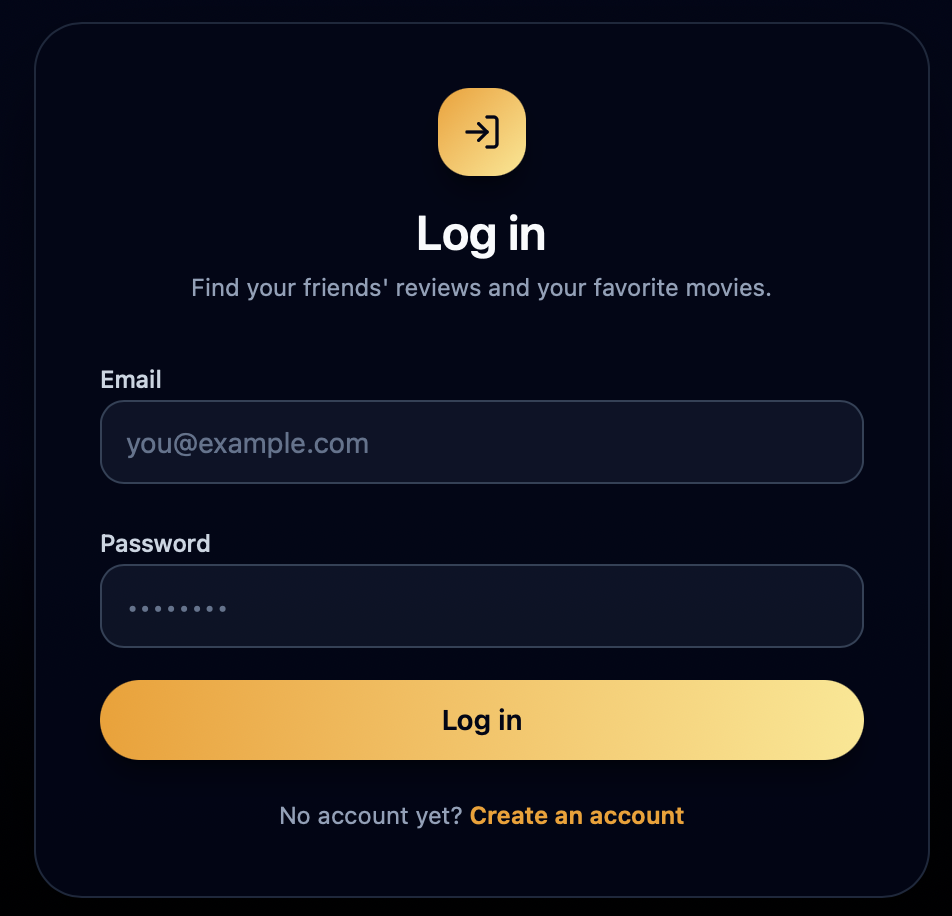
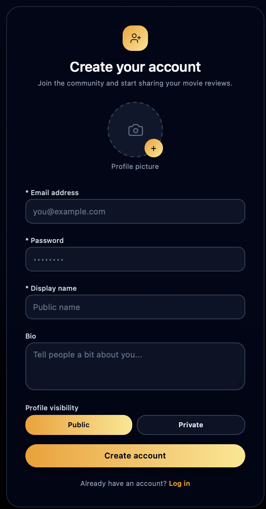
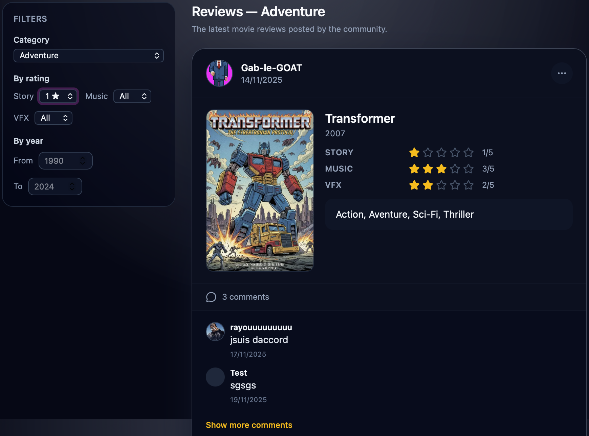
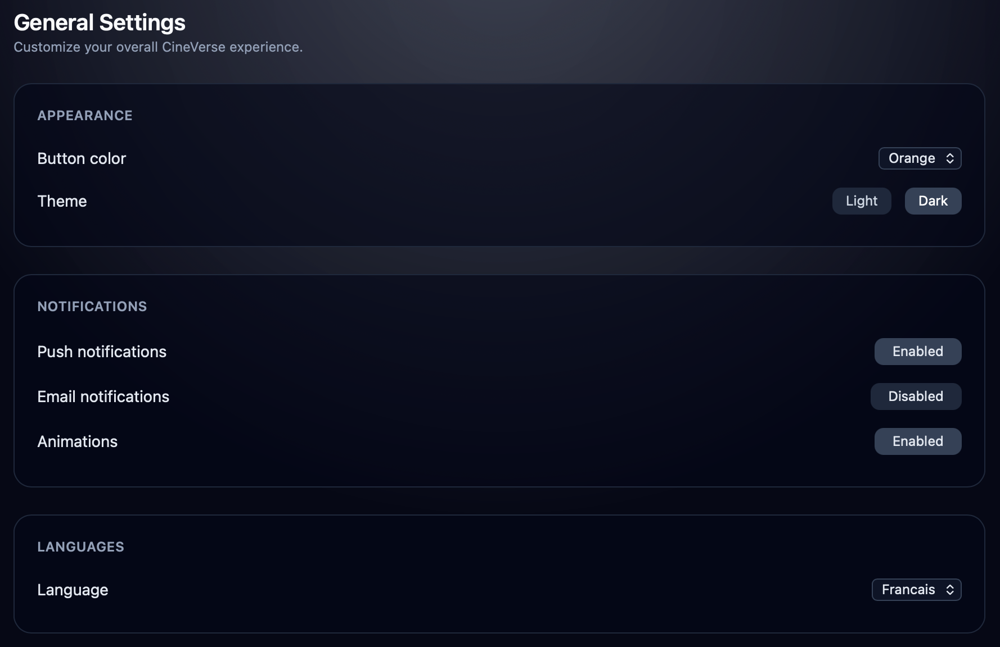
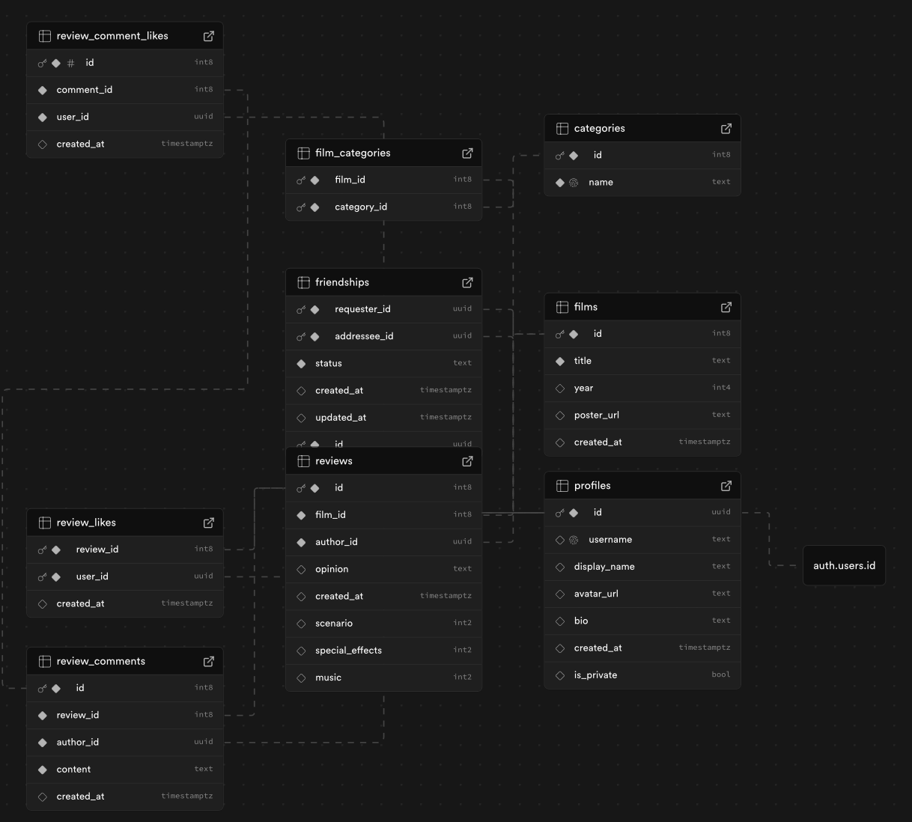
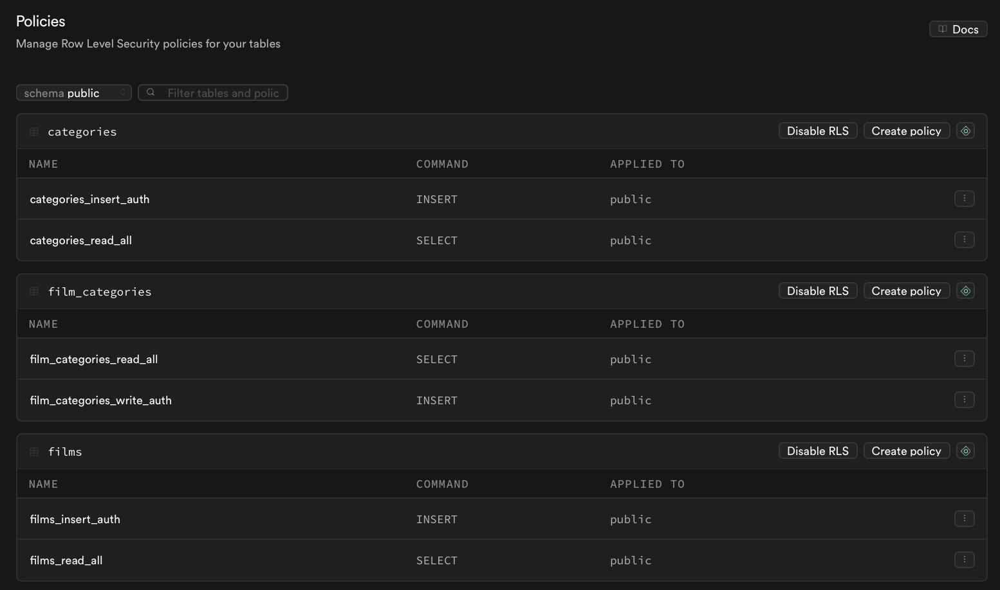
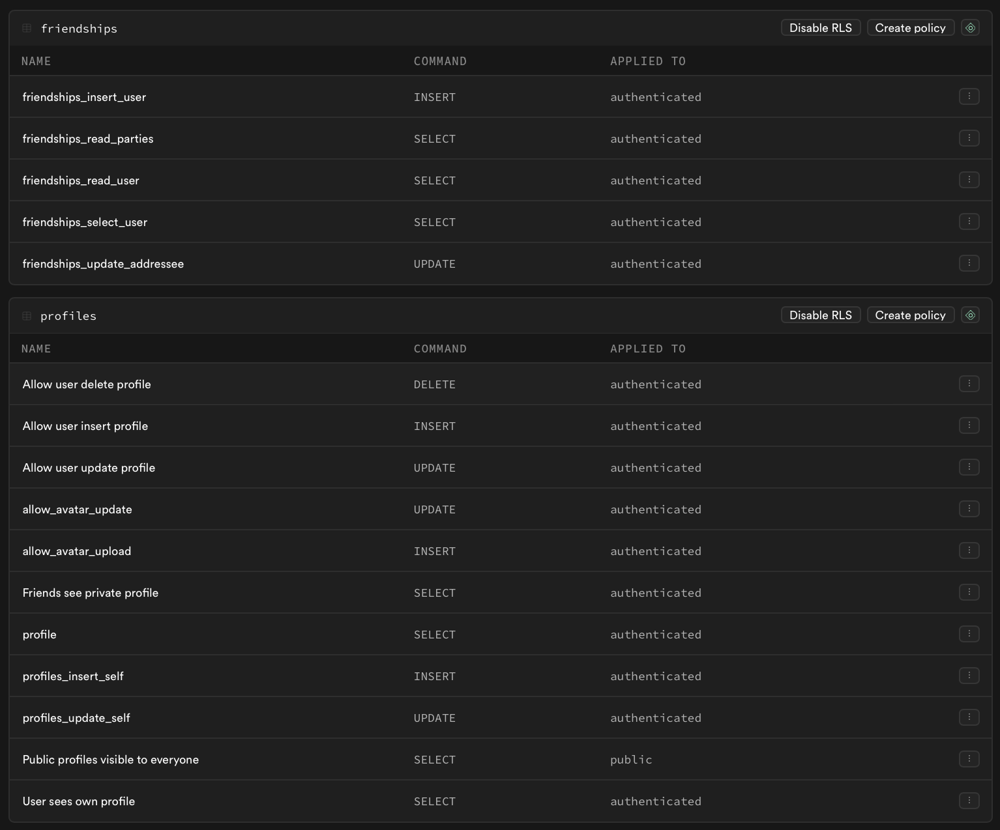
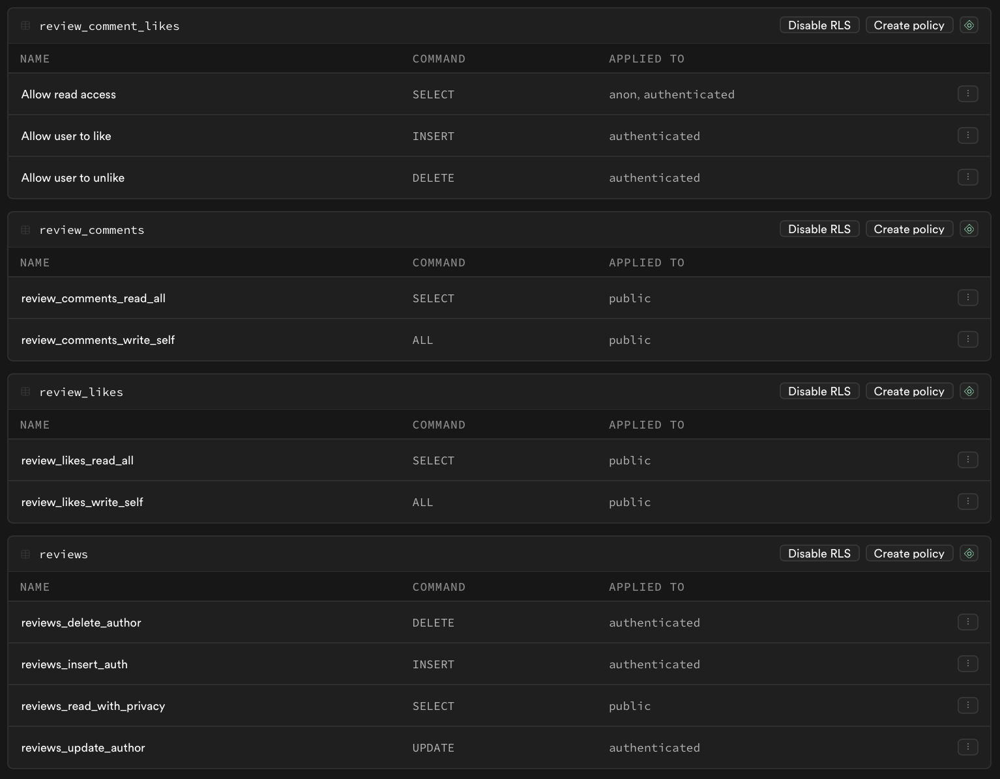

# Project Name: CineVerse

- **Team Members:**
  - Gabriel DALIBERT
  - Rayane GAAD
  - Kamil BENJELLOUN
- **Deployed URL:** [https://webtech-111.vercel.app]

---

## 1. Concept & User Experience

### Key Features (UI/UX)

---

## 2. Full-Stack Functionality

### Authentication

- [x] Sign-up implemented (with username, avatar, bio, privacy)
- [x] Sign-in implemented (email + password)
- [x] Sign-out implemented
- [x] The UI updates based on user state

**Notes**: Session handled through supabase.auth, protected routes, middleware, and redirections.

**Self-Evaluation:**: Fully implemented and stable.

### CRUD Operations

- **Main Resource:** [e.g., "Recipes"]
- [x] Create (write a review)
- [x] Read (feed, public feed, profile pages)
- [ ] Update (not implemented)
- [ ] Delete (not implemented)

**Notes**: Creation + display fully functional, no editing or deletion.

**Self-Evaluation:**: Partial (2/4 functionalities implemented).

### Data Relationships

- **Tables Involved:** 
- [x] Relationship implemented 

Tables Involved:
profiles, reviews, review_comments, review_likes, review_comment_likes, films, categories, film_categories, friendships

**Notes**: Several complex relationships handled correctly, including nested selects.
**Self-Evaluation:**: Strong implementation beyond minimum requirements.

### Search & Filtering

- [x] Search implemented
- [x] Filter implemented, available options:
- by category
- by year
- by scenario rating
- by music rating
- by VFX rating

**Self-Evaluation:**: Complete.

### External API Integration

- **API Used:** none
- **Data fetched:** N/A (all data stored in Supabase)

**Notes**: All data handled internally through Supabase.

**Self-Evaluation:**:

---

## 3. Engineering & Architecture

### Database Schema

**Self-Evaluation:**: Strong schema structure.

### Row Level Security (RLS)

**Notes**: RLS is fully configured across all tables, with precise policies ensuring correct permissions for read and write operations depending on user identity.

**Self-Evaluation:**: Implemented RLS correctly, ensuring secure data access while maintaining full functionality across the app.

### Server vs. Client Components

*Identify one significant Server Component and one Client Component in your app.*

**Server Component:** [app/feed-public/page.tsx]
    - *Why?* Fetches all public reviews server-side to improve SEO and reduce client-side load.

**Client Component:** [app/components/FilmCard.tsx]
    - *Why?* Contains interactive UI (comment posting, toggles, stateful UI), requiring hooks and onClick handlers.

---

## 4. Self-Reflection & Feedback

*This section must be completed **individually** by each team member.*

### Proudest Achievement

*What is the technically most difficult or most polished feature you built?*

[BENJELOUN Kamil]: My proudest achievement is implementing the complete authentication workflow and implementing the filtering logic.

[Name 2]: [Your answer here]

[Name 3]: [Your answer here]

### What Would You Improve?

*If you had more time, what would you add or improve in your project?*

[BENJELOUN Kamil]: If I had more time, I would add the ability to edit and delete reviews, implement real-time notifications for comments and friend requests, and finish full multilingual support.

[Name 2]: [Your answer here]

[Name 3]: [Your answer here]
